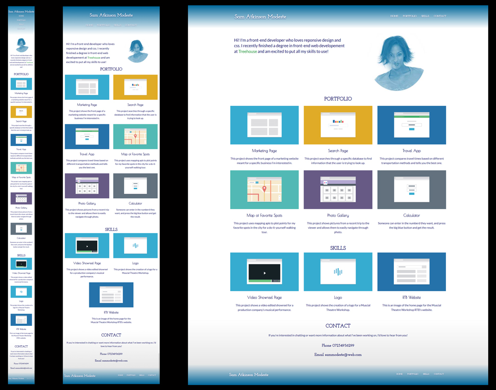

#  Team Treehouse - Project 2 - Mobile-first Responsive Layout

This is my second project for the [Front End Web Development Techdegree at Treehouse](https://teamtreehouse.com/techdegree/front-end-web-development).

### Description
Creating a responsive webpage with in-page links using the mobile-first approach. 

## Table of contents
- [Overview](#overview)
  - [About this project](#about-this-project)
  - [Screenshot](#screenshot)
  - [Link](#links)
- [Process](#my-process) 
  - [Technologies used](#technologies-used) 
  - [What I learned](#what-i-learned) 
  - [Continued development](#continued-development) 
  - [Useful resources](#useful-resources) 
- [Author](#author) 
- [Acknowledgments](#acknowledgments) 

## Overview
  
### About this project

### Screenshot of my project 2 Mobile, Tablet & Deskop layouts

